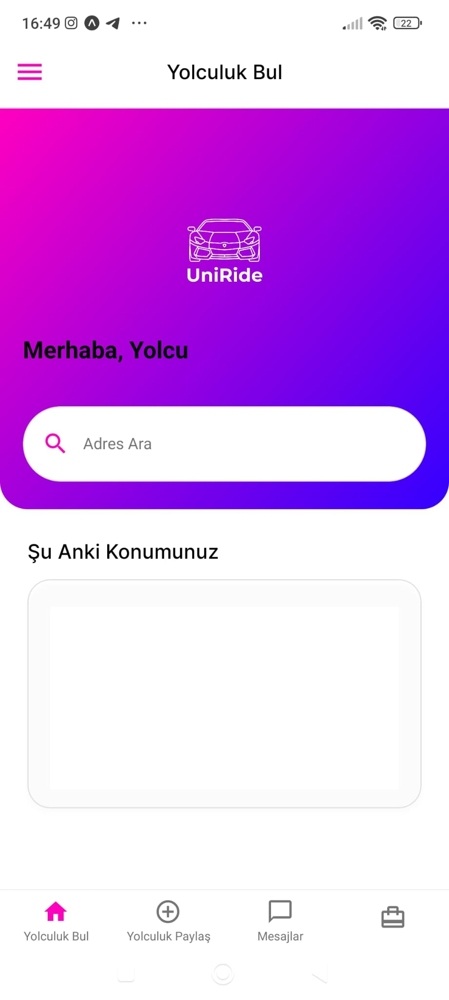
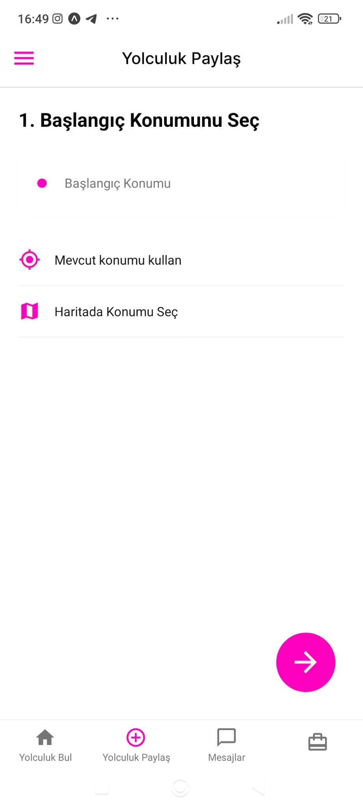
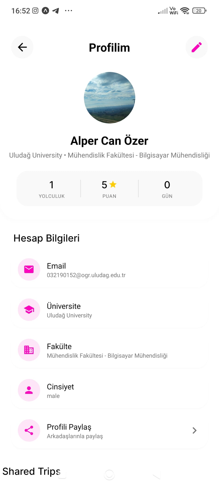
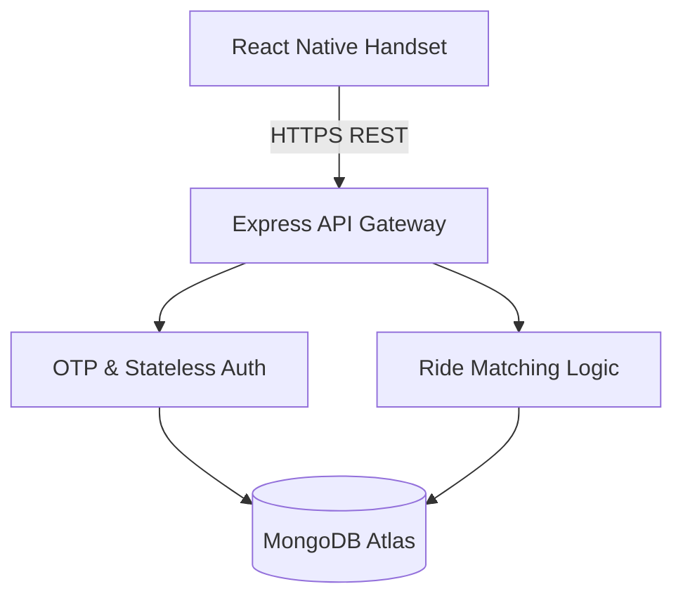

<div align="center">


<br/>
<br/>

# 🚗 UniRide

**Campus-native, peer-to-peer ride sharing — zero fees, zero friction.**

UniRide connects university students for shared commutes. No payments, no commercial overhead, no middlemen. Just students going the same direction.

<br/>

[](https://play.google.com/apps/testing/com.alper.uniride)

</div>

---

## 📸 Screenshots


Replace the block below with actual screenshots once available.
Recommended format: 3–5 images side by side using HTML img tags.

<div align="center">
  
  
  
</div>

---

## ✨ Features

- **Free to use, always** — No credits, no wallets, no payment rails. UniRide is a pure carpooling protocol.
- **OTP Authentication** — Stateless, secure login flow tailored for campus environments.
- **Real-time Ride Matching** — Geospatial matching engine pairs drivers and passengers heading the same way.
- **Campus-first UX** — Designed specifically for student schedules and university geolocations.
- **Cross-platform** — React Native / Expo ensures consistent experience across Android devices.

---

## 🏗️ Architecture

UniRide follows strict **Modular Decoupling** — frontend, backend, and persistence layers are independently deployable.



| Layer | Stack |
|---|---|
| Mobile Client | React Native + Expo |
| API Gateway | Node.js + Express.js |
| ORM / Migrations | Prisma |
| Database | MongoDB Atlas |
| Auth | OTP-based Stateless JWT |

---

## 🚀 Local Development

### Prerequisites

| Dependency | Version |
|---|---|
| Node.js | v18.x or higher |
| Expo CLI | Latest |
| MongoDB Atlas | Active cluster with IP whitelist |

### Setup

```bash
# Clone the repository
git clone https://github.com/Jessitoii/uniride.git
cd uniride

# Install root dependencies
npm install
```

#### Frontend

```bash
cd frontend
npm install
npx expo start
```

#### Backend

```bash
cd backend
npm install

# Configure environment
cp .env.example .env
# Fill in MONGODB_URI, JWT_SECRET, etc.

npm run dev
```

---

## 📁 Project Structure

```
uniride/
├── frontend/          # React Native / Expo app
│   └── README.md      # Client-side engineering docs
├── backend/           # Node.js / Express API
│   └── README.md      # Server & persistence docs
└── README.md          # ← You are here
```

📄 **Module Documentation:**
- [Client-Side Engineering →](frontend/README.md)
- [Server-Side & Persistence →](backend/README.md)

---

## 🧪 Beta Access

UniRide is currently in **closed beta** on Google Play.

[](https://play.google.com/apps/testing/com.alper.uniride)

If you're a student interested in testing, reach out or request access via the link above.

---

## 📄 License

This project is private and not open-source at this time.

---

<div align="center">
  <sub>Built for students, by students.</sub>
</div>